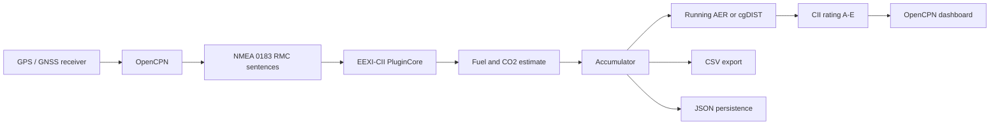
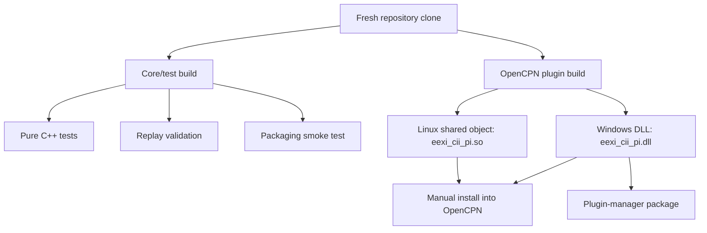
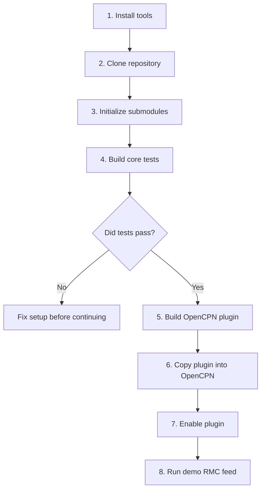
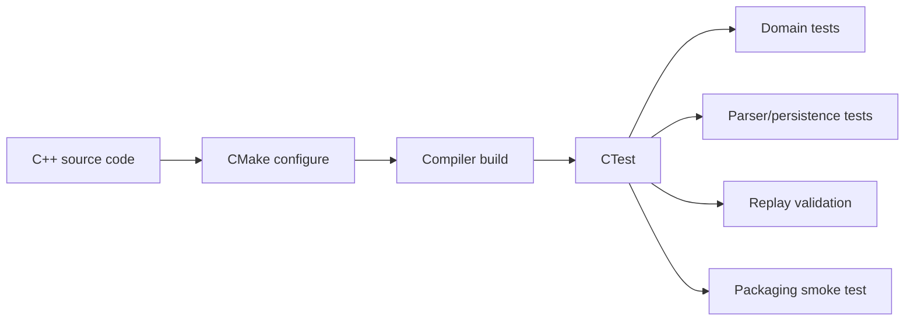
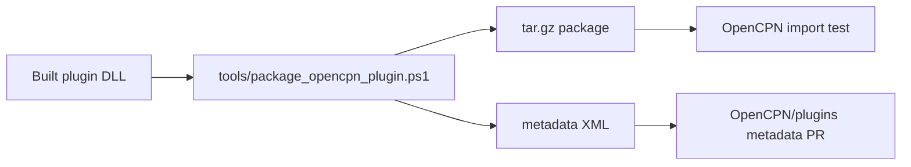

# EEXI-CII OpenCPN Plugin

This repository contains an OpenCPN plugin that estimates own-ship EEXI/CII
performance from live NMEA 0183 RMC navigation data. In simple terms: OpenCPN
receives GPS position and speed, the plugin estimates fuel and CO2, and the
dashboard shows a running CII rating.

The guide below is written for two audiences:

- **Beginners** who have little or no software-development background and need
  copy-paste setup steps.
- **Developers/reviewers** who need to build, test, package, and validate the
  plugin on a fresh Windows or Linux machine.

> Important: this plugin is an operational-awareness and research tool. It is
> not class-society validated and must not be used for official regulatory
> submission.

## Table Of Contents

1. [What This System Does](#what-this-system-does)
2. [System Diagram](#system-diagram)
3. [What You Will Build](#what-you-will-build)
4. [Recommended Path For Beginners](#recommended-path-for-beginners)
5. [Terminology For Non-Developers](#terminology-for-non-developers)
6. [Repository Layout](#repository-layout)
7. [Fresh Setup Checklist](#fresh-setup-checklist)
8. [Windows Setup](#windows-setup)
9. [Linux Setup](#linux-setup)
10. [Build And Test The Core Calculation Engine](#build-and-test-the-core-calculation-engine)
11. [Build The OpenCPN Plugin On Windows](#build-the-opencpn-plugin-on-windows)
12. [Build The OpenCPN Plugin On Linux](#build-the-opencpn-plugin-on-linux)
13. [Install The Plugin Into OpenCPN](#install-the-plugin-into-opencpn)
14. [Run A No-Hardware Demo](#run-a-no-hardware-demo)
15. [Package For OpenCPN Plugin Manager](#package-for-opencpn-plugin-manager)
16. [Validation And Test Matrix](#validation-and-test-matrix)
17. [Troubleshooting](#troubleshooting)
18. [Known Limitations](#known-limitations)
19. [Useful Links](#useful-links)

## What This System Does

The plugin watches the live RMC stream that OpenCPN already receives from GPS or
GNSS equipment. From each valid RMC sentence it reads:

- own-ship position,
- speed over ground,
- UTC date/time.

It then:

- estimates fuel consumption using the vessel profile,
- estimates CO2,
- accumulates year-to-date distance and CO2,
- calculates running AER or cgDIST,
- displays a CII rating from A to E,
- exports CSV summaries for review.

## System Diagram



## What You Will Build

This repository can be built in two different ways.



The **core/test build** is the safest first step. It proves the project can
compile and its calculations pass tests. It does not require OpenCPN.

The **OpenCPN plugin build** creates the actual plugin file that OpenCPN loads.
It needs wxWidgets and OpenCPN plugin API support from the `opencpn-libs`
submodule.

Current plugin wrapper target:

- OpenCPN plugin API: `1.21`
- Minimum OpenCPN version from bundled API metadata: `5.11.0`
- First validated plugin-manager package target: Windows `msvc-wx32` / `x86`

## Recommended Path For Beginners

If you are new to development, follow this order exactly:



Do not start with the OpenCPN plugin build. Start with the core tests. They are
faster, simpler, and give much clearer error messages.

## Terminology For Non-Developers

| Term | Meaning |
| --- | --- |
| Repository | The project folder containing all source code and docs. |
| Terminal / shell | A text window where you run commands. Windows uses PowerShell or Command Prompt. Linux uses a terminal. |
| Git | Tool used to download the source code and submodules. |
| CMake | Tool that prepares build files for your compiler. |
| Compiler | Tool that turns C++ code into programs or plugin files. |
| Ninja | A fast build runner used by CMake. Optional but recommended. |
| vcpkg | Windows dependency manager used here to install wxWidgets. |
| wxWidgets | UI toolkit used by OpenCPN plugins. |
| OpenCPN | The chartplotter/navigation application that loads the plugin. |
| NMEA 0183 RMC | GPS sentence containing position, speed, and time. |
| DLL | Windows plugin/library file. |
| `.so` | Linux shared library/plugin file. |
| CTest | Test runner included with CMake. |

## Repository Layout

```text
src/domain/          Pure C++ CII/EEXI calculations
src/data/            RMC parser, accumulator, persistence, distance calculations
src/plugin/          OpenCPN-independent plugin orchestration
src/opencpn/         OpenCPN adapter and exported plugin entry points
src/ui/              wxWidgets setup dialog and monitor dashboard
src/export/          CSV export helpers
tests/               Unit, replay, and packaging tests
tests/fixtures/      Synthetic replay and schema fixtures
tools/               Release packaging helper script
demo/                Demo RMC feed generator
docs/                Extra build, release, testing, and troubleshooting docs
opencpn-libs/        OpenCPN plugin API/support submodule
```

## Fresh Setup Checklist

Before building anything, make sure you have:

- a stable internet connection,
- at least 5 GB free disk space,
- permission to install developer tools,
- a folder path without special characters if possible.

Good project locations:

```text
C:\Projects\EEXI-CII
~/Projects/EEXI-CII
```

Avoid paths like:

```text
C:\Users\Your Name\OneDrive\Desktop\Very Long Folder Name\EEXI-CII
```

Long synced paths often make beginner setup harder than it needs to be.

## Windows Setup

### Windows Step 1: Install Git

Download and install Git for Windows:

```text
https://git-scm.com/download/win
```

During installation, the default options are fine.

Check it works:

```powershell
git --version
```

Expected output looks like:

```text
git version 2.x.x.windows.x
```

### Windows Step 2: Install Visual Studio

Install Visual Studio Community:

```text
https://visualstudio.microsoft.com/
```

When the installer asks which workload to install, select:

```text
Desktop development with C++
```

Make sure these components are included:

- MSVC C++ compiler,
- Windows SDK,
- CMake tools for Windows.

### Windows Step 3: Install CMake And Ninja

Visual Studio often includes CMake. Check first:

```powershell
cmake --version
```

Check Ninja:

```powershell
ninja --version
```

If Ninja is missing, install it using one of these options:

```powershell
winget install Ninja-build.Ninja
```

or:

```powershell
choco install ninja
```

If you do not have `winget` or Chocolatey, you can still build without Ninja by
omitting `-G Ninja` from the CMake commands.

### Windows Step 4: Clone The Repository

Open PowerShell and choose a simple folder:

```powershell
mkdir C:\Projects
cd C:\Projects
git clone <repo-url> EEXI-CII
cd EEXI-CII
```

Replace `<repo-url>` with the real Git URL.

### Windows Step 5: Download Submodules

This project uses OpenCPN support code as a Git submodule. Download it with:

```powershell
git submodule update --init --recursive
```

Check the OpenCPN plugin API file exists:

```powershell
Test-Path .\opencpn-libs\api-21\ocpn_plugin.h
```

Expected output:

```text
True
```

If it says `False`, run the submodule command again.

## Linux Setup

### Linux Step 1: Install Developer Tools

Debian or Ubuntu:

```sh
sudo apt update
sudo apt install -y git cmake ninja-build build-essential pkg-config
```

Fedora:

```sh
sudo dnf install -y git cmake ninja-build gcc-c++ pkgconf-pkg-config
```

Arch Linux:

```sh
sudo pacman -Syu git cmake ninja base-devel pkgconf
```

Check tools:

```sh
git --version
cmake --version
g++ --version
ninja --version
```

### Linux Step 2: Clone The Repository

```sh
mkdir -p ~/Projects
cd ~/Projects
git clone <repo-url> EEXI-CII
cd EEXI-CII
```

Replace `<repo-url>` with the real Git URL.

### Linux Step 3: Download Submodules

```sh
git submodule update --init --recursive
```

Check the OpenCPN plugin API file exists:

```sh
test -f opencpn-libs/api-21/ocpn_plugin.h && echo "OpenCPN API found"
```

Expected output:

```text
OpenCPN API found
```

## Build And Test The Core Calculation Engine

Do this on every new machine before trying to build the OpenCPN plugin.

### What This Step Proves



### Windows Core Build

From the repository root:

```powershell
cmake -S . -B build -G Ninja `
  -DEEXI_CII_BUILD_TESTS=ON `
  -DEEXI_CII_BUILD_OPENCPN_PLUGIN=OFF

cmake --build build
ctest --test-dir build --output-on-failure
```

If Ninja is not installed:

```powershell
cmake -S . -B build `
  -DEEXI_CII_BUILD_TESTS=ON `
  -DEEXI_CII_BUILD_OPENCPN_PLUGIN=OFF

cmake --build build
ctest --test-dir build --output-on-failure
```

### Linux Core Build

```sh
cmake -S . -B build -G Ninja \
  -DEEXI_CII_BUILD_TESTS=ON \
  -DEEXI_CII_BUILD_OPENCPN_PLUGIN=OFF

cmake --build build
ctest --test-dir build --output-on-failure
```

### Expected Core Test Result

You should see something like:

```text
100% tests passed, 0 tests failed out of 6
```

If the core tests fail, stop here. Fix the toolchain or dependency issue before
building the OpenCPN plugin.

## Build The OpenCPN Plugin On Windows

This is the most tested plugin build path in this repository.

### Why The Windows Build Uses x86

The bundled OpenCPN import library is:

```text
opencpn-libs/api-21/msvc-wx32/opencpn.lib
```

That library is 32-bit, so the plugin wrapper must be built with:

- x86 Visual Studio compiler,
- `x86-windows` vcpkg triplet,
- wxWidgets built for x86.

Do not use x64 for this build unless you also provide compatible x64 OpenCPN
plugin API/import libraries.

### Windows Plugin Step 1: Install OpenCPN

Install a compatible OpenCPN build. The bundled plugin API metadata says:

```text
Minimum OpenCPN version: 5.11.0
```

For local manual testing with this repository's current Windows wrapper, use a
compatible 32-bit OpenCPN install.

### Windows Plugin Step 2: Install vcpkg

Use a short path:

```powershell
cd C:\
git clone https://github.com/microsoft/vcpkg.git C:\vcpkg
C:\vcpkg\bootstrap-vcpkg.bat -disableMetrics
```

Install wxWidgets for x86:

```powershell
C:\vcpkg\vcpkg.exe install wxwidgets:x86-windows
```

This can take a while on a fresh system.

Important: OpenCPN checks the wxWidgets ABI before loading a plugin. The plugin
DLL must be built against the same wxWidgets runtime family as the OpenCPN
installation. For example, the local OpenCPN 5.14.0 test install reports
wxWidgets 3.2.9 and ships `wxbase32u_vc14x.dll` plus
`wxmsw32u_core_vc14x.dll`. A plugin built against vcpkg wxWidgets 3.3.1 imports
`wxbase331u_vc_custom.dll` and `wxmsw331u_core_vc_custom.dll`; OpenCPN marks
that DLL incompatible and it will not appear in `Options > Plugins`.

Before installing the DLL, check its imports:

```powershell
objdump -p .\build-opencpn-vcpkg-x86-release\eexi_cii_pi.dll |
  Select-String "DLL Name: wx"
```

For the OpenCPN 5.14.0 Windows build, the wx imports must be from the OpenCPN
`wxbase32u_*` / `wxmsw32u_*` family. If the output shows `wxbase331u_*` or
`wxmsw331u_*`, rebuild against a wxWidgets 3.2 `msvc-wx32` toolchain or the
official OpenCPN managed-plugin build environment before installing.

### Windows Plugin Step 3: Find `VsDevCmd.bat`

Visual Studio provides a setup script called `VsDevCmd.bat`. Common locations:

```text
C:\Program Files\Microsoft Visual Studio\2022\Community\Common7\Tools\VsDevCmd.bat
C:\Program Files\Microsoft Visual Studio\2022\Professional\Common7\Tools\VsDevCmd.bat
C:\Program Files\Microsoft Visual Studio\2022\Enterprise\Common7\Tools\VsDevCmd.bat
C:\Program Files\Microsoft Visual Studio\18\Community\Common7\Tools\VsDevCmd.bat
```

Set the path in PowerShell:

```powershell
$VsDevCmd = "${env:ProgramFiles}\Microsoft Visual Studio\2022\Community\Common7\Tools\VsDevCmd.bat"
```

If that file does not exist, update `$VsDevCmd` to the correct path.

Check:

```powershell
Test-Path $VsDevCmd
```

Expected output:

```text
True
```

### Windows Plugin Step 4: Configure The Plugin Build

From the repository root:

```powershell
cmd.exe /c "call ""$VsDevCmd"" -arch=x86 && cmake -S . -B build-opencpn-vcpkg-x86-release -G Ninja -DCMAKE_BUILD_TYPE=Release -DCMAKE_TOOLCHAIN_FILE=C:/vcpkg/scripts/buildsystems/vcpkg.cmake -DVCPKG_TARGET_TRIPLET=x86-windows -DEEXI_CII_BUILD_OPENCPN_PLUGIN=ON -DEEXI_CII_BUILD_TESTS=OFF"
```

If you installed vcpkg somewhere other than `C:\vcpkg`, change:

```text
C:/vcpkg/scripts/buildsystems/vcpkg.cmake
```

to your actual vcpkg path.

### Windows Plugin Step 5: Build The DLL

```powershell
cmd.exe /c "call ""$VsDevCmd"" -arch=x86 && cmake --build build-opencpn-vcpkg-x86-release"
```

Expected output file:

```text
build-opencpn-vcpkg-x86-release/eexi_cii_pi.dll
```

The build should also copy wx/runtime DLL dependencies into the same folder.

## Build The OpenCPN Plugin On Linux

Linux plugin building is useful for development. The first plugin-manager
release path in this repository is still Windows `msvc-wx32` / `x86`, but the
CMake wrapper can be configured on Linux with wxWidgets.

### Linux Plugin Step 1: Install wxWidgets

Debian or Ubuntu:

```sh
sudo apt update
sudo apt install -y libwxgtk3.2-dev
```

If that package does not exist:

```sh
apt-cache search libwxgtk
```

Install the closest wxWidgets GTK development package available for your
distribution.

Fedora:

```sh
sudo dnf install -y wxGTK-devel
```

Some Fedora versions use a name such as `wxGTK3-devel`.

Arch Linux:

```sh
sudo pacman -S wxwidgets-gtk3
```

Check wxWidgets:

```sh
wx-config --version
```

### Linux Plugin Step 2: Configure

```sh
cmake -S . -B build-opencpn-linux-release -G Ninja \
  -DCMAKE_BUILD_TYPE=Release \
  -DEEXI_CII_BUILD_OPENCPN_PLUGIN=ON \
  -DEEXI_CII_BUILD_TESTS=OFF
```

If CMake cannot find wxWidgets:

```sh
cmake -S . -B build-opencpn-linux-release -G Ninja \
  -DCMAKE_BUILD_TYPE=Release \
  -DEEXI_CII_BUILD_OPENCPN_PLUGIN=ON \
  -DEEXI_CII_BUILD_TESTS=OFF \
  -DwxWidgets_CONFIG_EXECUTABLE="$(command -v wx-config)"
```

### Linux Plugin Step 3: Build

```sh
cmake --build build-opencpn-linux-release
```

Expected output:

```text
build-opencpn-linux-release/eexi_cii_pi.so
```

### Linux Plugin Step 4: Install For Local Testing

OpenCPN plugin folders differ depending on whether OpenCPN was installed from a
distribution package, Flatpak, PPA, source build, or another package manager.

For manual testing:

1. Start OpenCPN.
2. Find the OpenCPN log from OpenCPN's Help/About or platform log location.
3. Look for the plugin search path.
4. Copy `eexi_cii_pi.so` into that plugin folder.
5. Restart OpenCPN.
6. Enable the plugin under `Options > Plugins`.

If you have a packaged tarball for your Linux target, prefer OpenCPN's Plugin
Manager import flow instead of manual copying.

## Install The Plugin Into OpenCPN

OpenCPN's `Options > Plugins` page shows installed plugins and plugin-catalog
entries. If you only see built-in/catalog plugins such as `ChartDownloader`,
`WMM`, `Dashboard`, or `GRIB`, then Blue Wake/EEXI-CII is not installed yet.
The `Dashboard` entry is OpenCPN's own dashboard plugin; it is not this plugin.

Also confirm the plugin binary is ABI-compatible before copying or importing it.
If OpenCPN has previously rejected the plugin, it may create a load-stamp file
and skip future attempts until that stamp is removed.

### Windows Manual Install

Close OpenCPN first.

From the repository root:

```powershell
$PluginDir = "$env:LOCALAPPDATA\opencpn\plugins"
New-Item -ItemType Directory -Force -Path $PluginDir | Out-Null

Copy-Item -LiteralPath (Get-ChildItem .\build-opencpn-vcpkg-x86-release -Filter "*.dll").FullName `
  -Destination $PluginDir `
  -Force
```

Then:

1. Start OpenCPN.
2. Open `Options > Plugins`.
3. Find `EEXI-CII`.
4. Enable it.
5. Complete the vessel profile setup dialog.
6. Click the `EEXI/CII Monitor` toolbar button.

If the plugin still does not appear after copying the DLLs, close OpenCPN and
check:

```powershell
Select-String -Path "C:\ProgramData\opencpn\opencpn.log" `
  -Pattern "eexi_cii_pi|incompatible|failed at last attempt"
```

If the log says `Incompatible plugin detected`, rebuild the plugin against the
same wxWidgets ABI used by OpenCPN. If the log says `failed at last attempt`,
OpenCPN is skipping the retry because of a load stamp. After replacing the DLL
with a compatible build, remove:

```text
C:\ProgramData\opencpn\load_stamps\eexi_cii_pi
```

Then restart OpenCPN.

### Plugin Manager Import

If you have a plugin-manager tarball:

1. Start OpenCPN.
2. Open `Options > Plugins`.
3. Click `Import plugin...`.
4. Select the generated `.tar.gz`, for example:
   `build/package-real/eexi_cii_pi-0.1.0-local-msvc-wx32.tar.gz`.
5. After import, find `EEXI-CII` or `Blue Wake` in the plugin list.
6. Enable the plugin.
7. Click `Apply` or `OK`.
8. Restart OpenCPN if requested.

The OpenCPN plugin catalog workflow expects direct import testing before
metadata is submitted upstream.

## Run A No-Hardware Demo

You do not need a real GPS receiver to test the dashboard. The repository
includes a demo script that sends synthetic RMC sentences over UDP.


### Configure OpenCPN

1. Start OpenCPN.
2. Open `Options > Connections`.
3. Configure a new network input connection. Some OpenCPN builds show this form
   immediately instead of an `Add` button:
   - Select `Network`, not `Serial`.
   - Network Protocol: `UDP`
   - Data Protocol: `NMEA 0183`
   - Address: `0.0.0.0`
   - DataPort: `10110`
   - Check `Receive Input on this Port`.
   - Leave `Output on this port` unchecked.
   - Leave input filtering blank. The default `Ignore sentences` option is fine
     when the sentence list is empty.
   - Click `OK`.
4. Open `Options > Plugins`.
5. Enable `EEXI-CII` or `Blue Wake`.

If the Plugins page only shows entries such as `ChartDownloader`, `WMM`,
`Dashboard`, and `GRIB`, install/import the plugin first using
[Install The Plugin Into OpenCPN](#install-the-plugin-into-opencpn). Do not
enable OpenCPN's built-in `Dashboard` plugin expecting it to be Blue Wake.

### Use A Demo Vessel Profile

If the setup dialog opens, use these demo values:

```text
Ship name: Demo Vessel
IMO number: 9999999
Ship type: Bulk carrier
Gross tonnage: 50000
Deadweight: 80000
Admiralty coefficient: 680
SFOC: 175
Fuel type: HFO
Displacement: 92000
SOG threshold: 1.0
Target year: Auto
```

### Start The Demo Feed

Windows:

```powershell
powershell -ExecutionPolicy Bypass -File .\demo\nmea_demo.ps1
```

Shorter Windows demo:

```powershell
powershell -ExecutionPolicy Bypass -File .\demo\nmea_demo.ps1 -DurationSeconds 120 -SpeedKnots 14.2
```

Linux with PowerShell 7:

```sh
pwsh -File ./demo/nmea_demo.ps1
```

Expected behavior:

- OpenCPN shows live GPS/SOG.
- The plugin dashboard changes from waiting to accumulating.
- SOG and CO2 rate update.
- Running AER and CII rating appear after enough movement.

More detail: `docs/PANEL_DEMO.md`.

## Package For OpenCPN Plugin Manager

Packaging creates:

- a `.tar.gz` plugin package,
- an XML metadata file,
- a SHA256 checksum in the XML.



Windows packaging example:

```powershell
powershell -NoProfile -ExecutionPolicy Bypass -File .\tools\package_opencpn_plugin.ps1 `
  -BuildDir build-opencpn-vcpkg-x86-release `
  -OutputDir dist `
  -Version 0.1.0 `
  -Release 1 `
  -TarballUrl https://example.invalid/releases/eexi_cii_pi-0.1.0-1-msvc-wx32.tar.gz `
  -SourceUrl https://github.com/<owner>/<repo> `
  -SchemaPath C:\path\to\OpenCPN\plugins\ocpn-plugin.xsd
```

Replace placeholder URLs before publishing:

```text
https://example.invalid/...
https://github.com/<owner>/<repo>
```

Expected files:

```text
dist/eexi_cii_pi-0.1.0-1-msvc-wx32.tar.gz
dist/eexi_cii_pi-msvc-wx32.xml
```

More detail: `docs/PLUGIN_MANAGER_RELEASE.md`.

## Validation And Test Matrix

| Area | Command or check | Expected result |
| --- | --- | --- |
| Core build | `cmake --build build` | Build succeeds |
| Automated tests | `ctest --test-dir build --output-on-failure` | All tests pass |
| Replay validation | Included in CTest | Synthetic RMC replay matches expected distance, CO2, AER, rating |
| Packaging smoke test | Included in CTest when PowerShell exists | Tarball, metadata XML, checksum, schema validation pass |
| Windows plugin build | `cmake --build build-opencpn-vcpkg-x86-release` | `eexi_cii_pi.dll` created |
| Linux plugin build | `cmake --build build-opencpn-linux-release` | `eexi_cii_pi.so` created |
| OpenCPN smoke test | Enable plugin and feed RMC | Dashboard updates |
| CSV export | Click dashboard CSV buttons | CSV files open in spreadsheet software |

Manual release checklist:

```text
docs/FIELD_TEST_GATE.md
```

Validation explanation:

```text
docs/VALIDATION_PACK.md
```

## Troubleshooting

### `git submodule` Did Not Download `opencpn-libs`

Run:

```sh
git submodule update --init --recursive
```

Then check:

```sh
ls opencpn-libs/api-21/ocpn_plugin.h
```

Windows:

```powershell
Test-Path .\opencpn-libs\api-21\ocpn_plugin.h
```

### CMake Says It Cannot Find A Compiler

Windows:

- Install Visual Studio with `Desktop development with C++`.
- Restart PowerShell after installation.
- For plugin builds, use `VsDevCmd.bat` with `-arch=x86`.

Linux:

```sh
sudo apt install -y build-essential
```

or on Fedora:

```sh
sudo dnf install -y gcc-c++
```

### CMake Says It Cannot Find wxWidgets

Windows:

```powershell
C:\vcpkg\vcpkg.exe install wxwidgets:x86-windows
```

Confirm your configure command includes:

```text
-DCMAKE_TOOLCHAIN_FILE=C:/vcpkg/scripts/buildsystems/vcpkg.cmake
-DVCPKG_TARGET_TRIPLET=x86-windows
```

Linux:

```sh
wx-config --version
```

If that fails, install the wxWidgets development package for your distribution.

### Windows Link Fails With Architecture Errors

You are probably building x64 by accident. Use:

```text
VsDevCmd.bat -arch=x86
```

and:

```text
-DVCPKG_TARGET_TRIPLET=x86-windows
```

### Plugin Does Not Appear In OpenCPN

If the Plugins page only shows entries such as `ChartDownloader`, `WMM`,
`Dashboard`, and `GRIB`, OpenCPN has not loaded Blue Wake/EEXI-CII yet.
Install it with `Import plugin...` or copy the Windows DLLs manually.

If you did copy/import it and it still does not appear, check
`C:\ProgramData\opencpn\opencpn.log`. A message like `Incompatible plugin
detected` usually means the plugin was built against a different wxWidgets ABI
than OpenCPN. A message like `failed at last attempt` means OpenCPN has
blocklisted the plugin with a load stamp after an earlier failed load.

Check:

- Did you copy the plugin file into the correct OpenCPN plugin folder?
- Did you restart OpenCPN after copying?
- Is your OpenCPN version compatible with API `1.21`?
- Did OpenCPN log a missing DLL or missing symbol error?
- On Windows, did you copy all generated DLL dependencies, not only
  `eexi_cii_pi.dll`?
- On Windows, does `objdump -p eexi_cii_pi.dll` show wx DLL names matching the
  wx DLLs shipped with OpenCPN?

### Dashboard Shows No GPS Fix

Check:

- OpenCPN is receiving RMC data.
- RMC sentence status is `A`, not `V`.
- Demo UDP connection is on port `10110`.
- The simulator script is still running.

More troubleshooting: `docs/TROUBLESHOOTING.md`.

## Known Limitations

- Operational awareness only.
- Not for official regulatory submission.
- Not class-society validated.
- Own-ship only.
- Uses RMC position and SOG input.
- Fuel is estimated with the Admiralty Coefficient method.
- No direct fuel-flow sensor integration.
- No IMO correction factors.
- Simplified EEXI model.
- First plugin-manager packaging path is Windows `msvc-wx32` / `x86`.

## Useful Links

- OpenCPN: https://opencpn.org/
- OpenCPN plugin catalog: https://github.com/OpenCPN/plugins
- OpenCPN plugin catalog testing guide:
  https://github.com/OpenCPN/plugins/blob/master/TESTING.md
- OpenCPN plugin support libraries: https://github.com/OpenCPN/opencpn-libs
- vcpkg: https://github.com/microsoft/vcpkg
- Git for Windows: https://git-scm.com/download/win
- Visual Studio Community: https://visualstudio.microsoft.com/
